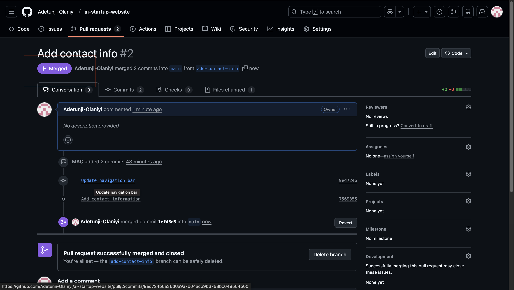

# Hands-On Project: Collaborative Website Development with Git and Github 

# Part 1: Setup and Initial Configuration

## 1. Install Git

Visit tthe official Git website and download the version of Git for your operating system. Follow the intallation instructions.

## 2. Create a Github Repository:

- Sign up or log in to Github.

- Click the "+" icon in the top-right corner and select "New repository."

- Name your repository (e.g., "ai-startup-website") and initialize it with a README file. 

- Click "Create repository"

## 3. Clone the Repository

- On your repository's page on GitHub, click the "Code" button and copy the HTTPS URL.

- Open your terminal or command prompt 

- Create a folder named "git-project" in the folder where you are storing all DAREY.IO related work. For example in the Desktop folder on your laptop, you may create a folder called "darey-training"

- Change directory into the "git-project"

- Clone (Download) the repository from Github using

`git clone [Past the URL copied from GitHub]`

- Since you just clonned your repository, your main branch is `main`

- Navigate into the repository you clonned

`cd ai-startup-website`

- Create an empty file "index.html"

- Add the content below

This is the Admin creating an index.html file for Tom and Jerry.

- Check changes has not been staged

`git status`

Stage changes:

`git add index.html`

Confirm changes have been staged for commit:

`git status`

Now, after staging the changes, the file name will appear in green in tthe terminal output. This colour change signifies that the file has been successfully staged, making it ready for the next step, which is committing these changes to the project's history.

- Commit changes

git commit -m "This is my first commit" 

This takes the changes and records them in the repository's history with a message describing twhat was done. This commit is a milestone, marking a specific point in the project's development

- Push main branch to Github:

`git push origin main` 

 

This sends commit from your main branch on your laptop to GuitHub (Remote Repository).

# Part 2: Simulating Tom and Jerry's Work

To simulate both Tom and Jerry working on the same laptop, you'll switch between two branches, making changes as each character 

1. Tom's Work

- Navigate to the project directory you just cloned: 

`cd ai-startup-website`

This moves you into the folder containing the cloned GitHub repository on your local machine. It's like stepping into the project's workspace.

- Check the current branch: This shows you a list of all branches in your local repository. initially, you'll see only the "main" branch because that's the default starting point and no other branches because that's the default starting point and no other branches have been created yet. 

`git branch`

- Create a new branch for Tom's work:

`git checkout -b update-navigation`

This creates a new branch named "update-navigation" (You can name it whatever you want) The command also automatically switches to the "main" branch. This branch "update-navigation" is where you'll simulate Tom's updates to the website without affecting whatever is in the main branch

- Check the branch again to see your newly created branch

`git branch` 

Running git branch again now shows your newly created branch, indicating you're now working in this new "workspaces" dedicated to Tom's navigation updates. 

Recall you created an empty file "index.html" in the main. The file will also exist in tthe `update-navigation-branch`: Open `index.html` and add the content below

- Add the content below
This is Tom adding Navigation to the AI-website

This simulates Tom's contribution to tthe project. This text represents the work he's doing on tthe navigation bar. In tthe real world, tthis will be an actual software code. 

-Check changes has not been staged

At this stage, Tom has modified the file, but these changes haven't been prepared for a commit in Git. This is indicated by the file name appearing in red in the terminal output, signaling that the changes are recognized by Git but not yet staged.

- Stage Tom's changes:

`git add index.html`

This tells Git that you want to include the updates made to index.html in the next commit. It's like saying, "Okay, i'm happy with these changes and ready to record them"

Confirm changes have been staged for commit 

 

Now, after staging the changes, the file name will appear in green in the terminal output. This colour changes signifies that the file has been successfully staged, making it ready for the next step, which is committing these changes to the project's history.

Commit Tom's changes 

`git commit -m "Update navigation bar"`

This takes the staged changes and records them in the repository's history with a message describing what was done. This commit is a milestone, marking a specific point in the project's development 

- Push Tom's branch to Github:

`git push origin update-navigation`

This sends Tom's commits from your local branch on your laptop to GitHub (Remote Repository). It's like publishing your work so that others (or in this case, Jerry") can see and interactt with it.  This step updates the remote repository with Tom's contributions 

After completing Tom's workflow, you will now simulate Jerry's contribution to the project. To do this, you'll

- Switch back to the main branch
- Create a new branch for Jerry
- Make changes, and then
Stage, commit and push these changes to GitHub.

2. Jerry's Work:

Switch back to the Main Branch:

`git checkout main`

This command switches your current working directory to the main branch, ensuring that jerry start from the latest version of the project.

- Pull the latest changes:

`git pull origin update-navigation`

This ensures that you have the latest updates from the repository, including Tom's merged changes, if any.

Create a New Branch for Jerry's Work:

`git checkout -b add-contact-info`

This creates a new branch where jerry will make his changes, keping them separate from the main project until they're ready to be merged.

Open index.html and Add Contact Information: Make your changes to the index.html file by adding contact information. This simulates Jerry' task.

Stage jerry's Changes 

`git add index.html`

This command stages the changes Jerry made to the index.html file, preparing them for commit.

- Commit Jerry's Changes:

git commit -m "Add contact information"

This saves Jerry's changes in the branch's history, with a message describing what was done.

-Push jerry's Branch to GitHub:

`git push origin add-contact-info`

This command uploads Jerry's branch tot he GitHub repository, making it available for review and merging into the main project.

So far, you have experienced collaboration between Tom and Jerry. But that's not all. Someone needs ttto review their work, merge the changes to the mian project, and resolve conflicts if any. In the next project, we will see how that works. 

# Part 3: Merging Changes

After both Tom and Jerry have pushed their changes, you (or another team member) can review and merge these changes into the main project. The process involves: 

1. Creating a Pull Request
2. Merging the Pull Request into the main branch 

## Understanding Pull request:

A Pull Request (PR) is a feature used in GitHub (and other Git-based version control systems) that allows you to notify team members about the changes you've pushed to a branch in a repository. Essentially, it's a request to review and pull in your contribution to the main project. Pull request are central to the collaborative development process, enabling team member to discuss, review and make further changes before changes are merged.

Creating a Pull Request on GitHub

After both Tom and Jerry have pushed their work to thier respective branches, the next step is to create a pull request for each of them. Here's how Tom would create a pull request for his changes:

### 1. Navigate to the GitHub Repository 

Open your web browser and go to the GibHub page fir the repository.

### 2. Switch to the Branch: 

We click on the branch dropdown menu near the top left corner of the file list and select the branch Tom been working on, in this case, "Update-Navigation" branch.

### 3. Create New Pull Request:

- Click the "New Pull Request" button next tto the branch dropdown menu.

- GitHub will take you to a new page to initiate a pull request. It automatically selects tthe main project's branch as the base and your recently pushed branch as compare branch. 

### 4. Review Tom's Changes:

Before creating the pull request, Tom would reveiw his changes to ensure everything is correct. GitHub shows the differences between the base branch and Tom's branch. It's a good opportunity for Tom to double-check his work.

### 5. Create the pull request:

If everything looks good, click the create pull request button.

Provide a title and dexcription for the pull request. The title should be concise and descriptive, and the description should explain the changes that the pull request is about, why its needed and any other relevant details.

After filling in the information, click create pull request again to officially open the pull request.

### 6. Review and Merging Tom's Pull Request

Once the pull request is created, it becomes visible to other team members who can review the changes, leave comment and request additional modifications if necessary. When the team agrees that the changes are ready and good to go, someone with merge permission can merge the pull request, incorporating the changes from Tom's update-navigation branch into the main branch.

### 7. Updating Jerry's Branch with Latest Changes

Before Jerry merges his changes into the main branch, it's is essential to ensure his branch is up to date with the main branch. This is because other changes (like Tom's update) might have been merged into the main branch after Jerry started working on his features. Updating ensure compatibility and reduces the chances of conflicts.

Steps to Update Jerry's Branch:

On the terminal, switch to Jerry's Branch:

Purpose: This command fetches the changes from the main branch (Remember, main branch now has Tom's chnages) and merges them into Jerry's add-account-info branch. It ensures that any updates made to the main branch, like Tom's merged changes, are now included in jerry branch. This step is crucial for avoiding conflicts and ensuring that jerry's work can smoothly integrate with the main project.

Merge the pull request to the main branch: Click the merge pull request button to merge Tom's changes into the main branch. This action combines Tom's contibution with the rest of the project, completing the collaborative workflow.

Finalizing Jerry's Contribution
Assuming there are no conflicts, Jerry's branch is now ready to be merged back into the main project.

Push the updated Branch to GitHub:

git push origin add-account-info

This command upload Jerry's changes to the GitHub. Now, his branch reflects both his work and lates updates from the main branch.

The origin keyword in the command refers to the default name Git gives to the remote repository from which we clone the project. Its like a shortcut or an alias for the full URL of the repository in GitHub.

Now lets create the pull request (PR) for jerry's changes, similar to how we did for Tom.

Merged Jerry's pull request. complete the process by merging the PR into the main branch.

This simulated workflow illustrate how Git facilitate collaboartive development, allowing multiple work simulataneously on different aspect of a project and merge thier contribution seamlessly, even while working on the same files.

End. 